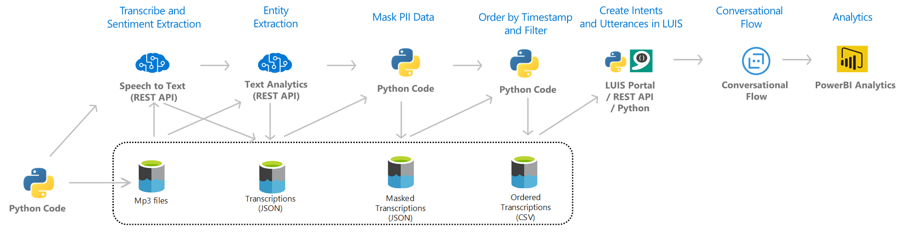

# Call Centre Analytics using Microsoft Speech to Text

In this project we provide a template for building a Speech to Text transcription service on Azure which is applicable for Call Center Analytics. As of 30/03/2020 the code provided here only caters for up to the Masking the PII data part of the solution architecture below. Integration with LUIS and Bot Framework and further analysis in Power BI will be coming soon in this github repo.

### Prerequisites

To be able to run the Python scripts provided in this repo you must have the following Azure resources provisioned in your subscription within a resource group:
* Speech to Text 
* Text Analytics
* Storage Account (Blob)

In addition to the preceding Azure resources, you must also have the following installed in your local environment:
* Python 3.6 or above 
* pip install azure-cognitiveservices-language-textanalytics
* pip install azure-storage


### Architecture of Solution



### Running the transription process

To execute the transcription of audio files and the subsequent entity extraction and masking carry out the following steps

1. Create a container within your storage account (e.g. data)
2. Using Storage Explorer create a folder within this container (e.g. input)
3. Upload your .mp3 or .wav files in this folder
4. In a command prompt or terminal session run the following:
```
python transcribe_blobs.py input/ output/
```
The input/ and output/ are folders within the data container in your storage account. The output folder will be created if it doesn't exist. The input folder contains your uploaded .mp3 or .wav files. The output folder contains the transcriptions in JSON format.

5. To extract entities and mask those entities in the JSON files run the following:
```
python MaskBlobTranscriptions.py output/ output/
```
The above will save the corresponding JSON transcription with a 'Masked_' prefix which now has masked entities in the transcribed text. This is useful when you want to protect PII data.
